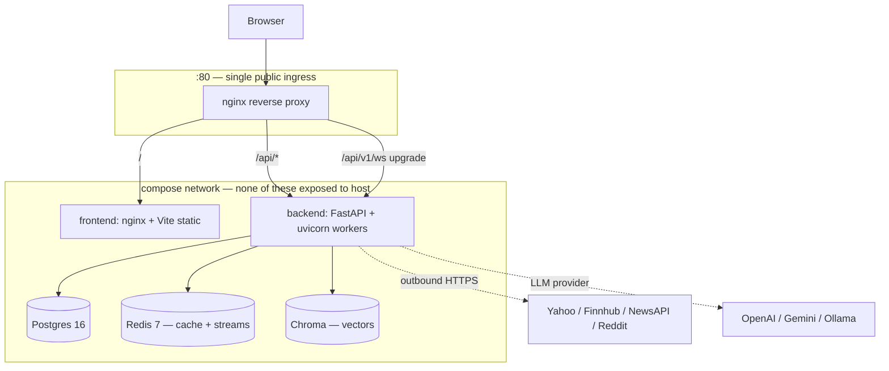
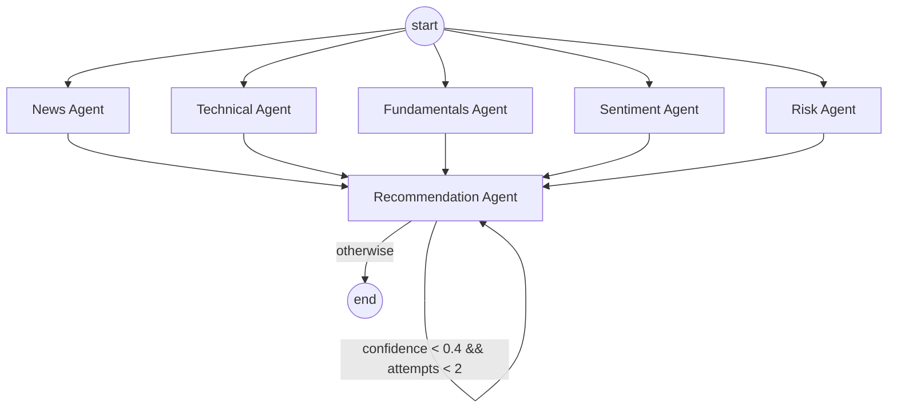

# Architecture

A single-page reference. Diagrams use Mermaid so they render inline on GitHub.

---

## 1. System topology (production)



In dev the same compose file runs without nginx; the frontend hits the backend directly on `localhost:8000`. See `docker-compose.prod.yml` for the override.

---

## 2. Multi-agent workflow (LangGraph)



- **Fan-out** from `START`: 5 signal agents execute concurrently, each in its own DB session.
- **Barrier** at `Recommendation`: waits for all 5 (or their `None` placeholders if they failed).
- **Reflection** is a self-loop conditional on confidence + attempt count.

---

## 3. Real-time pipeline

```mermaid
flowchart LR
  watch[(watchlist_items)] -. "every 15s" .-> prod[Price Producer]
  market[Yahoo/Finnhub] -. "cached quotes" .-> prod
  prod -- XADD --> stream[("Redis stream:prices<br/>MAXLEN 10k")]

  stream -- "consumer group<br/>ws_broadcasters" --> wsc[WS Broadcaster]
  stream -- "consumer group<br/>alert_evaluators" --> ae[Alert Evaluator]

  wsc -- "ws.send_json" --> hub[WSHub]
  hub -- "type: price" --> browsers[Connected browsers]

  ae -- "match? cooldown?" --> rules[(alert_rules)]
  ae -- "fire" --> events[(alert_events)]
  ae -- "notify" --> hub2[WSHub → toast]
  ae -- "notify" --> mail[Notifier → SMTP]
  ae -- "re_run_analysis?" --> graph[LangGraph workflow]
```

Two consumer groups on the same stream — independent at-least-once delivery with per-group PEL. Adding a third (e.g. analytics tap) is one `XGROUP CREATE`.

---

## 4. RAG pipeline

```mermaid
flowchart LR
  up[File / URL / text upload] --> bg[BackgroundTask]
  bg --> ext[extractors: pypdf / bs4]
  ext --> ch[TextChunker<br/>1000 chars, 200 overlap]
  ch --> emb[FastEmbedEmbedder<br/>BAAI/bge-small-en-v1.5]
  emb --> chr[(Chroma collection<br/>"documents")]
  bg --> doc[(documents: status=ready)]

  q[POST /rag/query] --> emb2[embed_query]
  emb2 --> chr
  chr --> top[top-k chunks<br/>filtered by user_id + symbol]
  top --> prompt[RAG prompt]
  prompt --> llm[LLM]
  llm --> ans[answer + citations]
```

- One Chroma collection, multi-tenant via `user_id` + optional `symbol` metadata filters.
- Background ingestion: `Document.status` polls from `processing` → `ready` so the UI can show progress.

---

## 5. Backend layout (key directories)

```
backend/app/
├── ai/
│   ├── agents/         BaseAgent + 6 agents + output_parser
│   ├── embeddings/     Embedder ABC + fastembed impl
│   ├── graph/          LangGraph state, nodes, workflow
│   ├── llm/            LLMClient ABC + Ollama/OpenAI/Gemini
│   ├── prompts/        *.md prompt files (versioned)
│   ├── rag/            chunker, extractors, prompts, RAGService
│   ├── tools/          indicators (pandas/numpy)
│   └── vectorstore/    VectorStore ABC + Chroma impl
├── api/v1/             Versioned route modules (one per resource)
├── core/               security, cache, redis, exceptions
├── db/models/          SQLAlchemy 2.0 models
├── notifications/      Notifier ABC + Console + Email
├── schemas/            Pydantic DTOs (the only types crossing HTTP)
├── services/           Framework-free business logic
└── streaming/          StreamBus, WSHub, producer, consumers
```

Every subsystem follows the **abstract-base + adapter + factory** pattern. Listed in the interview doc.
